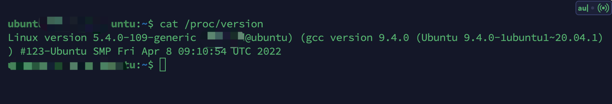
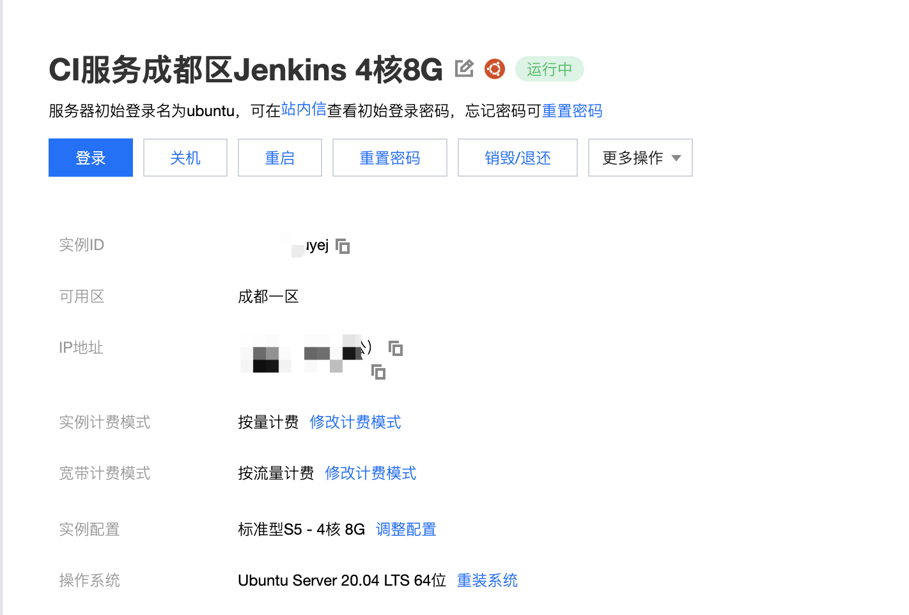
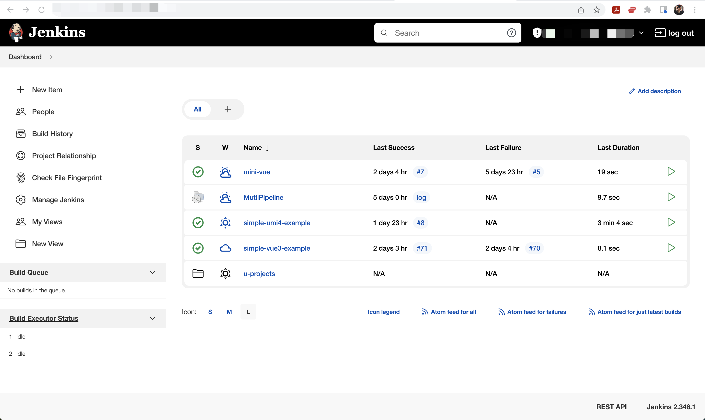
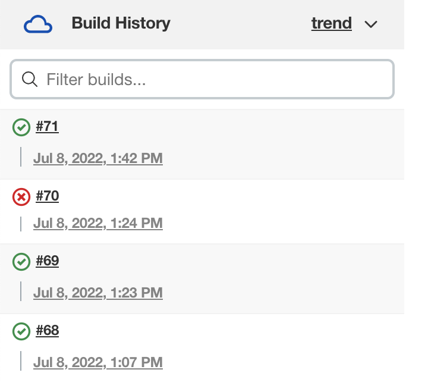
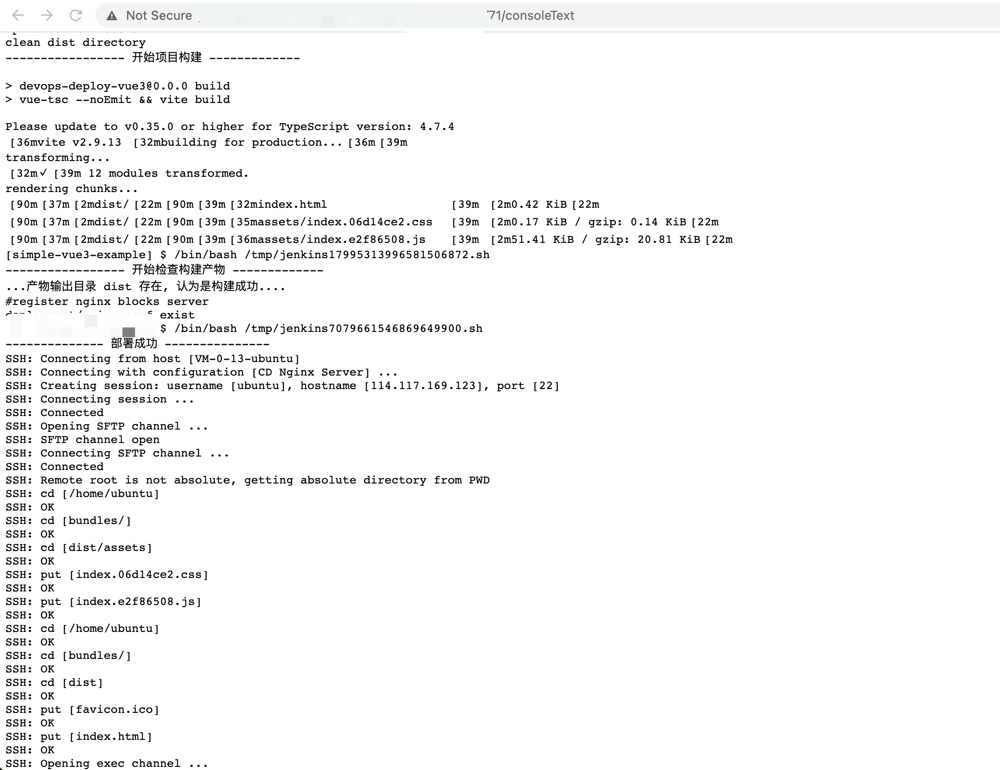
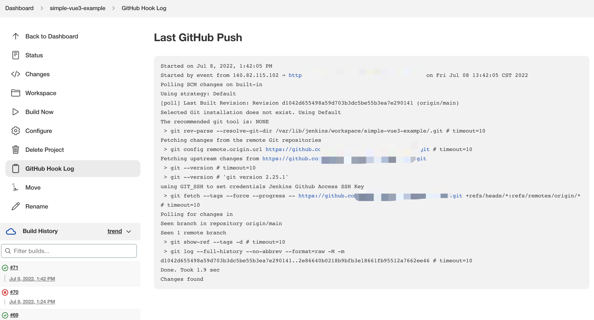
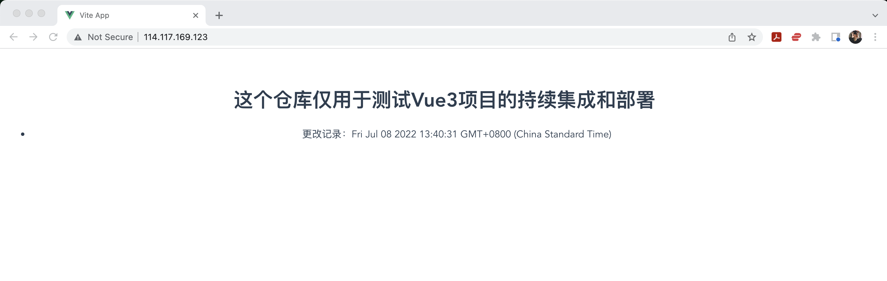

# 基于 Jenkins CI/CD 服务 案例展示

从非开发者角度出发

```bash
Client WebUI --- Golang Server --- Jenkins Server --- CI/eg: FeatureFlag/GithubServer --- CD/Docker And Nginx --- Client WebUI/Github/Email
```

开发者角度

```bash
Git Client Hook(Git Push) --- Git Server HooK(Git Push Event) --- Server Pull SCM Trigger/Hook  --- CD/Docker And Nginx --- Github/Email
```

## Machines

操作系统：Ubuntu 20.04 LTS


- CI 服务, 4 核 8G, 主要运行 Jenkins 以及提供 API 供 Golang 调用
  
- CD 服务, 2 核 4G, 运行 Docker 镜像和 2 个 Nginx 服务（一个对内网/一个为外网提供服务）
  - 其中一台部署了 WebUI 服务, 隔离后面的所有平台

## Jenkins

WorkSpace


Build History


Build Logs


Git Hook


## WebUI

> TODO

## Server Example


